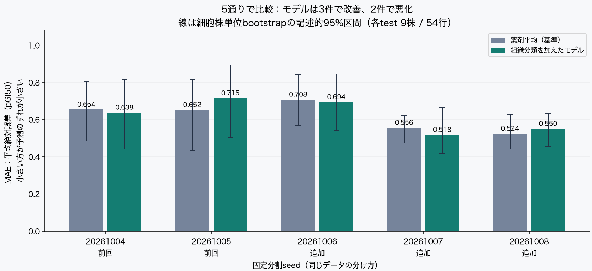
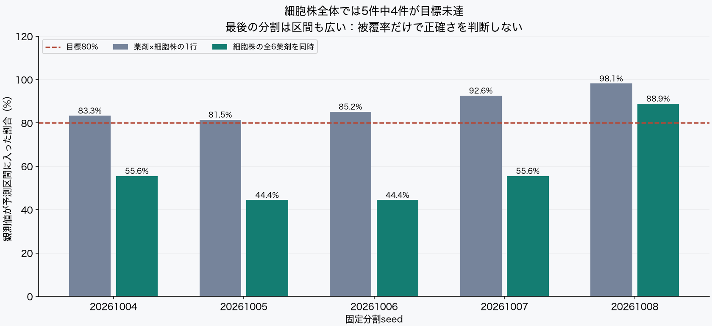

# MAEN 結果と読み方 — 2026-10-06

[結果サイト](https://yuu-honda.github.io/maen-results/) · [前回結果を保存したページ](history/2026-10-05/index.html)

**組織情報を足すと予測は良くなる？ 5分割で3件が改善、2件が悪化。安定した改善は未確認です。**

同じ6薬剤×55細胞株＝330行を再配置し、モデルを変えず事前固定seed20261006/20261007/20261008の3件だけ追加しました。データは増えていません。5件の独立した研究でもなく、人に薬が効く確率を示していません。

MAEは予測と実験値のずれを平均した数で、小さい方が良い値です。線はtest細胞株単位の200回bootstrapによる記述的95%区間。

|分割seed|基準MAE|モデルMAE|差（モデル−基準）|基準 / モデルRMSE|
|---|---:|---:|---:|---|
|20261004 / 前回|0.654|0.638|-0.016（改善）|0.829 / 0.825|
|20261005 / 前回|0.652|0.715|+0.063（悪化）|0.866 / 0.906|
|20261006 / 追加|0.708|0.694|-0.013（改善）|0.890 / 0.877|
|20261007 / 追加|0.556|0.518|-0.038（改善）|0.702 / 0.671|
|20261008 / 追加|0.524|0.550|+0.026（悪化）|0.686 / 0.703|

細胞株全体の80%目標被覆率は5件中4件で未達。最後の分割は区間も広くなっています。被覆率だけで予測精度は判断できません。

## 専門用語と意味

- **GI50**：細胞の増殖を50%抑制する濃度。治癒率・死亡率・生存率ではありません。
- **pGI50 = −log10(GI50 [M])**：濃度をモル単位で対数変換した物差し。1つの予測で1ずれると濃度比は10倍。大きい値ほど低濃度で増殖抑制されたことを表します。
- **MAE**：|予測−観測|の平均。0.65は65%効いたという意味ではありません。
- **RMSE**：誤差二乗の平均の平方根。大きな外れをMAEより強く反映します。
- **baseline**：学習データの薬剤平均。モデルはこれに組織残差の縮小平均（固定係数10）を追加。
- **seed**：同じ計算を再現する固定分割番号。評価値を見て選び直しません。
- **リーク**：評価情報が学習へ混入すること。同じ細胞株の全薬剤をまとめて分割し、防ぎます。

## 検証条件

全て学習37株/222行、校正9株/54行、test9株/54行。組織ごとにSHA256で固定分割。同じ細胞株は分割を跨がず、薬剤は全分割に共通。評価対象は既知薬剤に対する未見細胞株で、未知化合物ではありません。

薬剤ごとに最大NumExpの集約濃度群を採用。単位log10(M)・endpoint GI50・重複・分類を検証し、6薬剤共通株に限定。3株未満の前立腺群2株を除外。モデル/入力checksumは前回と同じです。

校正株ごとの最大絶対残差の有限標本補正80%分位点を半幅に使用。9株では8番目の値。層化分割と不均一な集約条件のため厳密な被覆保証は主張しません。5分割は株が重なるので独立試行として合成検定は行いません。

各実計算秒・区間半幅・被覆率・出典URL・SHA256は[集計JSON](summary.json)。平易な要約から専門詳細と再現手順を辿れる[結果サイト](index.html)に全説明を掲載しています。

## 限界と次に必要な検証

原実験/プレート単位の独立性、打ち切り情報、培養条件は集約XMLから完全には復元できません。薬剤の最高濃度も異なります。次は元条件の取得可否を確認し、条件を揃えた独立データ・他施設の検証を設計する段階です。未知化合物・生体内・臨床効果は未検証。

NCI/DTP公式[Compound Inhibition Bulk Data Download](https://dtp.cancer.gov/dtpstandard/subsets/comp.jsp)由来。[NCIの一般再利用方針](https://www.cancer.gov/policies/copyright-reuse)をデータ固有の再配布許可とみなしません。生XML・細胞株別表・非公開コードを転載せず集計結果だけを公開。本体コードは非公開なので公開閲覧者の完全再現環境を提供したとは主張しません。
